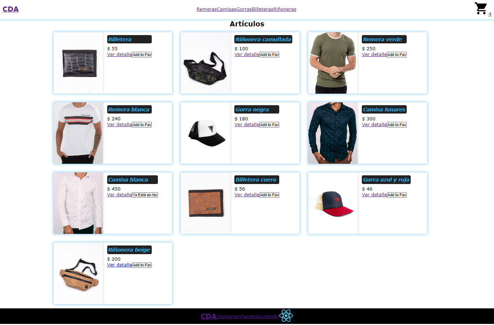

# Proyecto E-Commerce

Proyecto número 1 del curso de **React** dictado por Eric Wajnrajch y facilitado por CDA-Informática

## Probar proyecto en local
1. Clonar repositorio
   
    `git clone https://github.com/ferMossier/CursoReactCDA.git`

2. Instalar dependencias

    `nmp install`

3. Correr el proyecto
   
   `npm start`

## Librerías utilizadas

- react-router-dom
  - Utilizado para implementar ruteo dinámico en la aplicación